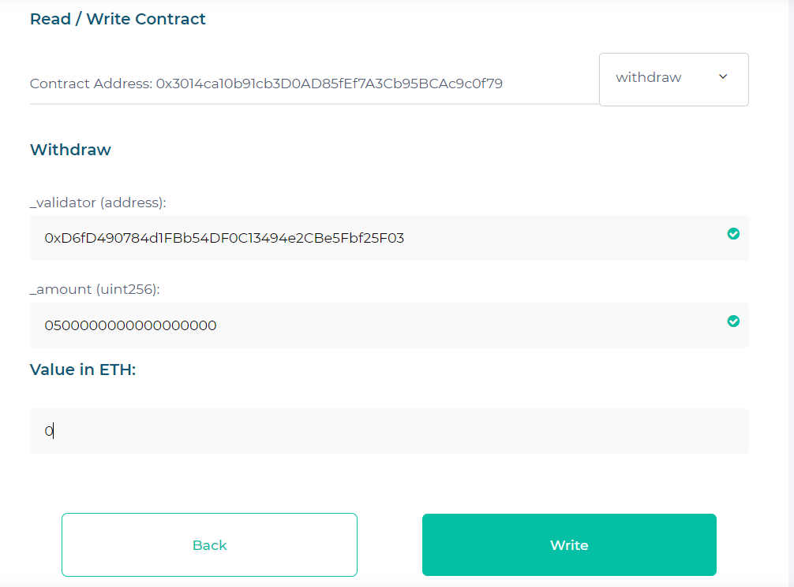

# Staking tutorial using Ledger

_This tutorial was made using Ledger Nano S with firmware version 1.6.1 and Ethereum app version on Ledger Nano S was 1.3.7._

**Step 1:** Please make sure that you have installed the latest version of Ethereum app on your Ledger as shown below.

**Step 2:** Go to [www.myetherwallet.com](http://www.myetherwallet.com/) and click **“Access my Wallet”**.

**Step 3:** Click “**Hardware**” then select “**Ledger**” then click “**Continue**” and then click **“Next”** as shown below.

**Step 4:** Once you click “Next” in the previous step now you will have to change the Network to **“Eram network” and then** select the Wallet address you would like to Send/Receive ERAM tokens, accept the terms and conditions and click on **“Access my Wallet”.**

**Step 5:** Now that you have logged in to your address in Ledger through MyEtherWallet on Eram network, you can see your Eram address \(Fusenet\), balance, etc.

**Now let’s learn how to stake ERAM.**

**Step 6:** Click on **“Contract”** and then click on Interact with contract and

1. Enter the consensus contract address **0x476c29c5589BFE3C0E4A509bb92545882bb4Db82**
2. Copy the consensus ABI from below link

[https://raw.githubusercontent.com/EclatDev/Eram/master/abis/Consensus\_abi.json](https://raw.githubusercontent.com/EclatDev/Eram/master/abis/Consensus_abi.json)

Click on **“Continue”**.

**Step 7:**

From the drop down select the **“Delegate”** function and then copy the “**Validator address”** from the staking UI. Enter the amount of ERAM you want to stake under **“Value in ETH”** and click on **“Write”**. In the below example I have copied ”Liquify” validators address to stake.

Review and confirm the transaction on your Ledger. Once the transaction is confirmed on-chain it means you have staked your ERAM successfully.

Now lets learn to withdraw the staked ERAM.

**Step 8**: Follow Step 1 to Step 6 from above.

From the drop down select the **“Withdraw”** function and then copy the “**Validator address”** from the staking UI to which you have delegated your stake. Enter the amount of ERAM you want to stake under **“\_amount\(uint256\)”, “value in ETH”** should be 0 and click on **“Write”**.

Review and confirm the transaction on your Ledger. Once the transaction is confirmed on-chain it means you have unstaked your ERAM successfully.

